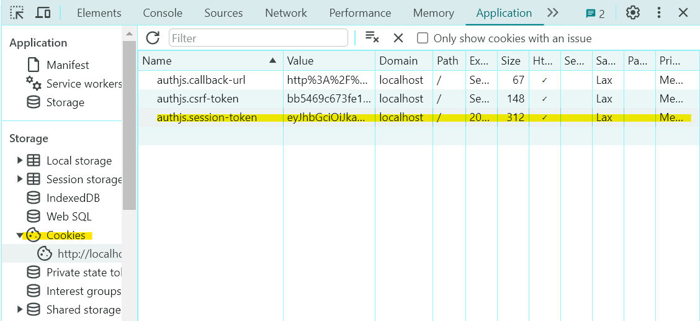

# About
- [Next + React Query로 SNS 서비스 만들기](https://inf.run/CkkYA)
- NextJs + TypeScript 를 사용하여 x.com을 클론코딩 합니다!
- 사용 도구
  - Node 18.19.1
  - Next 14.1.0
- [Next.js 공식문서](https://nextjs.org/docs)

## 🎁 목차
#### [0. 시작하기](#-시작하기)
#### [1. Intro](#-intro)
#### [2. Mock Service Worker 사용하기](#-mock-service-worker-사용하기)
#### [3. Next-Auth 사용하기](#-next-auth-사용하기)
#### [4. Tanstack Query 사용하여 서버의 데이터 가져오기](#-tanstack-query-사용하여-서버의-데이터-가져오기)


## 🎁 시작하기
```shell
$ npx create-next-app@latest

√ What is your project named? ... z-com
√ Would you like to use TypeScript? ... No / `Yes`
√ Would you like to use ESLint? ... No / `Yes`
√ Would you like to use Tailwind CSS? ... `No` / Yes
√ Would you like to use `src/` directory? ... No / `Yes`
√ Would you like to use App Router? (recommended) ... No / `Yes`
√ Would you like to customize the default import alias (@/*)? ... `No` / Yes

$ yarn dev
# 또는 
$ npm run dev
```
- 혹시 node version 문제로 실행이 안된다면?
```shell
# 노드 버전 확인
$ node -v

# nvm 설치
# https://github.com/coreybutler/nvm-windows/releases

# nvm 에서 설치 가능한 노드 버전 확인
$ nvm list available

# 필요한 버전 설치
$ nvm install 18.19.1

# 사용가능한 버전 확인
$ nvm list

# 필요에 따라 버전 변경하여 사용
$ nvm use 18.19.1

# 혹시 yarn 설치 안되어있다면
$ npm install -g yarn
```

## 🎁 Intro
### 0. 뭐가 다른데? 
- Next?
  - 리액트 위에서 돌아가는 프레임워크
  - 리액트는 뷰(화면) 외에 라이브러리로 해결 하던 것들을
  - 넥스트는 라우팅, 캐싱, 스타일링, 최적화, 배포 (+서버 기능) 까지 수행
- `App Router` / Pages Router
  - 디렉토리 기능 변경
  - 레이아웃 기능 추가
  - 편리한 페이지별 권한 체크 (미들웨어 사용)
- React 18 - 서버 컴포넌트 활용
  - 서버에서 랜더링하므로 클라이언트의 부담이 줄어드는 만큼 서버의 부담이 늘어
  - 서버의 부하를 줄이기 위해 캐싱을 적극적으로 사용함

### 1. 레이아웃 잡기
- 레이아웃 : 페이지를 이동해도 바뀌지 않는 것
- Root Layout → 개별 Layout → 개별 Page 의 계층 구조를 가짐
- app 폴더는 주소창과 연관되어 있기 때문에 주소와 동일한 폴더 구조로 만들어주기

- `Dynamic Routes`
  - 레이아웃 단위로 사용
  - user name이나 게시글 id처럼 계속 변경되는 주소는 대괄호로 폴더 만들기
  - 로그인/로그아웃 처럼 상태에 따라 레이아웃이 다른 경우에는 소괄호로 폴더 만들기
- `Parallel Routes`
  - 페이지 여러개를 띄우고 싶을 때 사용 (모달)
  - 폴더이름 앞에 @를 붙여서 만듦
- `Intercepting Routes`
  - 페이지 위에 모달을 띄우고 싶을 때 사용
  - 기존의 폴더를 대체해서 모달 폴더 내에 (..)폴더명 또는 (.)폴더명  등으로 만듦 (부모폴더 경로 잘 보기)
  - 링크를 통해 접근하면 인터셉터 동작
- private folder 
  - 공통컴포넌트 작업 등 파일 정리를 위한 폴더
  - 폴더명 앞에 언더바를 붙여서 만듦

### 2. 서버 컴포넌트? 클라이언트 컴포넌트?
> 이부분은 개념정리랑 공부가 좀 더 필요하다!  
> - 참고할 만한 자료  
>   - https://html-jc.tistory.com/657  
>   - https://velog.io/@2ast/React-%EC%84%9C%EB%B2%84-%EC%BB%B4%ED%8F%AC%EB%84%8C%ED%8A%B8React-Server-Component%EC%97%90-%EB%8C%80%ED%95%9C-%EA%B3%A0%EC%B0%B0  

- page.tsx, layout.tsx 등 기본적으로 서버 컴포넌트 → 서버에서 구동 됨
- 하지만 useState 같은 hooks는 클라이언트 컴포넌트에서만 사용 할 수 있음
- 바꾸는 방법은 파일 최상단에 `“use client”;` 써주면 됨
- 클라이언트 컴포넌트는 서버 컴포넌트를 import 해서 쓸 수 있음 (반대의 경우는 글쎄?)
- 리다이렉트의 경우에도 차이가 좀 있음
```javascript
// 서버 측에서 리다이렉트 할 경우
// 인터셉트 라우트 동작 하지 않음
import {redirect} from 'next/navigation';
export default function Login() {
  redirect('/i/flow/login')
}

// 클라이언트 측에서 리다이렉트 할 경우
// 인터셉트 라우트 작동
"use client";
import { useRouter } from 'next/navigation';
export default function Login() {
  const router = useRouter();
  router.replace('/i/flow/login');
}
```
## 🎁 Mock Service Worker 사용하기
- [https://mswjs.io/docs/getting-started](https://mswjs.io/docs/getting-started)
- msw 라이브러리 추가
  ```shell
  # 버전 확인 잘 하기 "msw": "2.1",
  $ npx msw init public/ --save
  $ npm install msw --save-dev
  ```
- handlers.ts, browser.ts, http.ts 작성
- MSW Component 작성 및 env 파일 작성
  - NEXT_PUBLIC : 브라우저에서 접근 가능한 환경 변수
  - API_MOCKING : 서버에서 접근 가능한 환경 변수
- [`handlers.ts`](/z-com/src/mocks/handlers.ts) 에 mock api 작성하기
- mock server 띄우기
  ```shell
  # package.json의 scripts에 추가
  "mock": "npx tsx watch ./src/mocks/http.ts"

  # 서버 실행
  $ yarn mock
  ```
- Server Component와 Client Component 분리 잘 해주기!

## 🎁 Next-Auth 사용하기
- [https://next-auth.js.org/getting-started/example](https://next-auth.js.org/getting-started/example)
- **`Login Provider`** : 카카오, 네이버 등 간편 로그인을 쉽게 구현 할 수 있도록 지원
- **`Credential Provider`** : 로그인, 로그아웃 등을 기본 지원, 로그인에 따른 쿠키 관리 지원
- Next-Auth 라이브러리 추가
  ```shell
  # 버전정보 확인 잘 하기!!
  # "@auth/core": "^0.19.1"
  # "next-auth": "^5.0.0-beta.3",

  $ npm i @auth/core@0.19 next-auth@5.0.0-beta.3
  ```
- `auth.ts` 작성
  - `CredentialsProvider` 의 `authorize(credentials, req)` 함수를 통해 인증 처리
  - 이때 `credentials` 객체의 속성값이 고정되어있어서 우리가 사용하고자 하는 형식으로 변환 필요
    ```typescript
    async authorize(credentials, req) {
        const res = await fetch(`${process.env.NEXT_PUBLIC_BASE_URL}/api/login`, {
          method: 'POST',
          headers: { 
            "Content-Type": "application/json" 
          },
          body: JSON.stringify({
            id: credentials?.username,
            password: credentials?.password,
          }),
        })
        
        const user = await res.json()
  
        if (res.ok && user) {
          return {
            email: user.id,
            name: user.nickname,
            image: user.image,
            ...user,
          }
        }
    } 
      
    //클라이언트 사이드에서 사용할 때
    await signIn("credentials", { 
      username: id,
      password: password,
      redirect: false,
    }); 
    ```
- `middleware.ts` 작성
  - nextjs에서 페이지를 렌더링하기 전에 서버 측에서 실행되는 함수
  - Request, Response 객체에 접근할 수 있음
  - src 폴더에 포함되거나, app과 같은 수준의 트리에 존재해야 함
  - 특정 조건에 맞는 유저만 url에 접근가능하게 할 수 있음
- `<SessionProvider>`로 감싸준 컴포넌트에서는 user 속성을 가져올 수 있음
  ```typescript
  //client Component일때
  import { useSession } from "next-auth/react";
  const { data: session } = useSession();

  //server
  import { auth } from "@/auth";
  const session = await auth();
  ```
- 로그인을 하고나면 쿠키가 자동 생성되는 것을 확인 할 수 있음!
  

## 🎁 Tanstack Query 사용하여 서버의 데이터 가져오기
- [https://tanstack.com/query/v5/docs/framework/react/overview](https://tanstack.com/query/v5/docs/framework/react/overview)
- Tanstack Query 왜 쓰는데?!
  - **서버에서 데이터를 가져오는 것 + `캐싱` 이 주 목적**
  - 컴포넌트 간 데이터 공유 용이
  - 로딩 / 성공 / 실패 등의 interface 표준화
  - `query key system`
  - 참고 : Redux는 데이터를 컴포넌트 간 공유하는 것이 주 목적
- tanstack-query 라이브러리 추가
  ```shell
  $ npm i @tanstack/react-query@5
  $ npm i @tanstack/react-query-devtools@5 -D
  ```
- tanstack-query 데이터 상태
  
  - fresh : 서버에서 데이터 불러 온 최신 상태 (최신의 정의: 내가 정함)
  - **`stale`** : 기회가 되면(refetchOnWindowFocus, retryOnMount, refetchOnReconnect, ...) 데이터를 새로 가져옴
    - tanstack-query의 기본정책은 stale이다!
  - staletime : 캐시를 얼마나 유지할 것인가
  - gctime: 쿼리가 inactive 상태가 되면 gcTime 후 메모리에서 정리
  - staletime < gctime
  - refetch : 화면에 안보여도 필요한 데이터들 가져올 때
  - invalidate : 화면에 안보이면 데이터 안가져 옴
  - reset : 초기데이터가 있는 경우, 초기데이터로 리셋
  - trigger loading : 로딩 상태 확인
  - trigger error : 에러 상태 확인
- `<RQProvider>` 안에 감싸진 Component 간 데이터 공유가 가능!
  ```typescript
  <RQProvider>
    <div className={style.rightSectionWrapper}>
      <div className={style.rightSectionInner}>
        <main className={style.main}>
          {children}
        </main>
        <section className={style.rightSection}>
          <RightSearchZone />
          <TrendSection />
          <FollowRecommendSection />
        </section>
      </div>
    </div>
    {modal}
  </RQProvider>
  ```
- 서버 컴포넌트에서 불러온 데이터를 클라이언트 컴포넌트에서도 사용하기 
  ```typescript
  //서버 컴포넌트
  import { HydrationBoundary, QueryClient, dehydrate } from '@tanstack/react-query';

  const queryClient = new QueryClient();
  await queryClient.prefetchQuery({ queryKey: ['users', username], queryFn: getUser });
  const dehydratedState = dehydrate(queryClient);

  return (
    <main className={style.main}>
      <HydrationBoundary state={dehydratedState}>
        <UserInfo username={username} />
        <div>
          <UserPosts username={username} />
        </div>
      </HydrationBoundary>
    </main>
  )

  //클라이언트 컴포넌트
  import { useQueryClient } from '@tanstack/react-query';

  const queryCLient = useQueryClient();
  const user = queryCLient.getQueryData(['users', username]);
  ```
- 클라이언트 컴포넌트에서 직접 사용하기
  - `queryFn`은 `_lib` 폴더에서 작성
  ```typescript
    const { 
    data, 
  } = useQuery<IPost, Object, IPost, [_1: string, _2: string]>({
    queryKey: ['posts', id],
    queryFn: getSinglePost,
    staleTime: 60*1000, //default 0ms (fresh => stale time)
    gcTime: 5*60*1000, //default 5*60*1000 ms (5분)
  });
  ```
- 무한 스크롤 구현하기
  - 라이브러리 설치
    ```shell
    $ npm i react-intersection-observer --save
    ```
  - `useInfiniteQuery` 사용하기
    ```typescript
    const { 
    data, 
    fetchNextPage, 
    hasNextPage, 
    ...
    } = useInfiniteQuery<..., number>({
      ...
      initialPageParam: 0,
      getNextPageParam: (lastPage) => lastPage.at(-1)?.postId,
      ...
    });

    //인피니티 스크롤 구현을 위한 react-intersection-observer
    const { ref, inView } = useInView({
      //div 태그 보이자 마자 호출하기 위하여
      threshold: 0, //몇픽셀 후 호출
      delay: 0, //몇초 후 호출
    });

    useEffect(() => {
      if (inView) {
        //데이터를 가져오는중이 아니면서
        //다음 페이지가 있을 때
        //다음 페이지를 가져옴!
        !isFetching && hasNextPage && fetchNextPage();
      }
    }, [fetchNextPage, hasNextPage, inView, isFetching])
    return (
      <>
        {data?.pages.map((page, i) => (
          <Fragment key={i}>
            {page.map((post) => <Post key={post.postId} post={post} />)}
          </Fragment>
        ))}
        //여기서 scroll 인식
        <div ref={ref} style={{height: 50}} />
      </>
    )
    ```
- Suspense를 이용하여 로딩, 에러처리 최적화 하기
  - [https://react.dev/reference/react/Suspense](https://react.dev/reference/react/Suspense)
  - [https://nextjs.org/docs/app/building-your-application/routing/loading-ui-and-streaming](https://nextjs.org/docs/app/building-your-application/routing/loading-ui-and-streaming)
  - [https://nextjs.org/docs/app/building-your-application/routing/error-handling](https://nextjs.org/docs/app/building-your-application/routing/error-handling)
  - error.tsx, loading.tsx, page.tsx 파일을 작성하면 NextJs가 알아서 계층 만들어줌
    ```typescript
    <ErrorBoundary fallback={<Error />}>
      <Suspense fallback={<Loading />}>
        <Page />
      </Suspense>
    </ErrorBoundary>
    ```
  - 클라이언트 컴포넌트에서 사용하려면
    - 필요한 부분에만 React Suspense를 사용하거나
      ```typescript
      //서버 컴포넌트
      import { Suspense } from 'react';
      <Suspense fallback={<Loading />}>
        <TabDeciderSuspense />
      </Suspense>

      //클라이언트 컴포넌트
      const { data } = useSuspenseQuery<IPost[]>({
        ...
      });
      ```
    - tanstack-query에서 파라미터 받아서 별도 처리
      ```typescript
      const { 
        data, 
        isFetching, //데이터를 가져올떄(queryFn 호출될 떄) => true
        isPending, //완전 처음 불러올때 => true
        isLoading, //isPending && isFetching
        isError, //에러발생 하면 => true
      } = useQuery<...>({
        ...
      });
      if (isPending) {
        return (
          ...
        )
      }
      ```

## 🎁 
- 
