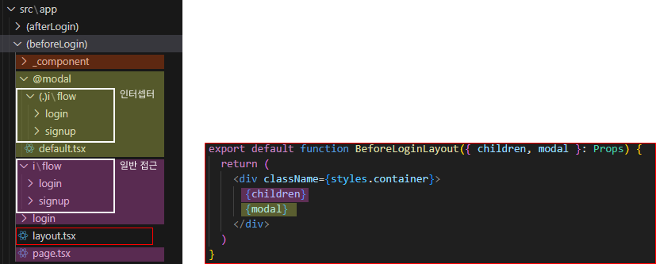

# About
- [Next + React Query로 SNS 서비스 만들기](https://inf.run/CkkYA)
- NextJs + TypeScript 를 사용하여 x.com을 클론코딩 합니다!
- 사용 도구
  - Node 18.19.1
  - Next 14.1.0
- [Next.js 공식문서](https://nextjs.org/docs)

## 🎁 시작하기
```shell
$ npx create-next-app@latest

√ What is your project named? ... z-com
√ Would you like to use TypeScript? ... No / `Yes`
√ Would you like to use ESLint? ... No / `Yes`
√ Would you like to use Tailwind CSS? ... `No` / Yes
√ Would you like to use `src/` directory? ... No / `Yes`
√ Would you like to use App Router? (recommended) ... No / `Yes`
√ Would you like to customize the default import alias (@/*)? ... `No` / Yes

$ yarn dev
# 또는 
$ npm run dev
```
- 혹시 node version 문제로 실행이 안된다면?
```shell
# 노드 버전 확인
$ node -v

# nvm 설치
# https://github.com/coreybutler/nvm-windows/releases

# nvm 에서 설치 가능한 노드 버전 확인
$ nvm list available

# 필요한 버전 설치
$ nvm install 18.19.1

# 사용가능한 버전 확인
$ nvm list

# 필요에 따라 버전 변경하여 사용
$ nvm use 18.19.1

# 혹시 yarn 설치 안되어있다면
$ npm install -g yarn
```

## 🎁 Intro
### 0. 뭐가 다른데? 
- Next?
  - 리액트 위에서 돌아가는 프레임워크
  - 리액트는 뷰(화면) 외에 라이브러리로 해결 하던 것들을
  - 넥스트는 라우팅, 캐싱, 스타일링, 최적화, 배포 (+서버 기능) 까지 수행
- `App Router` / Pages Router
  - 디렉토리 기능 변경
  - 레이아웃 기능 추가
  - 편리한 페이지별 권한 체크 (미들웨어 사용)
- React 18 - 서버 컴포넌트 활용
  - 서버에서 랜더링하므로 클라이언트의 부담이 줄어드는 만큼 서버의 부담이 늘어
  - 서버의 부하를 줄이기 위해 캐싱을 적극적으로 사용함

### 1. 레이아웃 잡기
- 레이아웃 : 페이지를 이동해도 바뀌지 않는 것
- Root Layout → 개별 Layout → 개별 Page 의 계층 구조를 가짐
- app 폴더는 주소창과 연관되어 있기 때문에 주소와 동일한 폴더 구조로 만들어주기

- `Dynamic Routes`
  - 레이아웃 단위로 사용
  - user name이나 게시글 id처럼 계속 변경되는 주소는 대괄호로 폴더 만들기
  - 로그인/로그아웃 처럼 상태에 따라 레이아웃이 다른 경우에는 소괄호로 폴더 만들기
- `Parallel Routes`
  - 페이지 여러개를 띄우고 싶을 때 사용 (모달)
  - 폴더이름 앞에 @를 붙여서 만듦
- `Intercepting Routes`
  - 페이지 위에 모달을 띄우고 싶을 때 사용
  - 기존의 폴더를 대체해서 모달 폴더 내에 (..)폴더명 또는 (.)폴더명  등으로 만듦 (부모폴더 경로 잘 보기)
  - 링크를 통해 접근하면 인터셉터 동작
- private folder 
  - 공통컴포넌트 작업 등 파일 정리를 위한 폴더
  - 폴더명 앞에 언더바를 붙여서 만듦

### 2. 서버 컴포넌트? 클라이언트 컴포넌트?
> 이부분은 개념정리랑 공부가 좀 더 필요하다!  
> - 참고할 만한 자료  
>   - https://html-jc.tistory.com/657  
>   - https://velog.io/@2ast/React-%EC%84%9C%EB%B2%84-%EC%BB%B4%ED%8F%AC%EB%84%8C%ED%8A%B8React-Server-Component%EC%97%90-%EB%8C%80%ED%95%9C-%EA%B3%A0%EC%B0%B0  

- page.tsx, layout.tsx 등 기본적으로 서버 컴포넌트 → 서버에서 구동 됨
- 하지만 useState 같은 hooks는 클라이언트 컴포넌트에서만 사용 할 수 있음
- 바꾸는 방법은 파일 최상단에 `“use client”;` 써주면 됨
- 클라이언트 컴포넌트는 서버 컴포넌트를 import 해서 쓸 수 있음 (반대의 경우는 글쎄?)
- 리다이렉트의 경우에도 차이가 좀 있음
```javascript
// 서버 측에서 리다이렉트 할 경우
// 인터셉트 라우트 동작 하지 않음
import {redirect} from 'next/navigation';
export default function Login() {
  redirect('/i/flow/login')
}

// 클라이언트 측에서 리다이렉트 할 경우
// 인터셉트 라우트 작동
"use client";
import { useRouter } from 'next/navigation';
export default function Login() {
  const router = useRouter();
  router.replace('/i/flow/login');
}
```
  